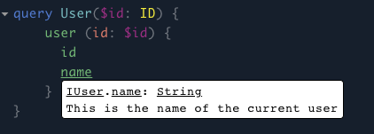

# GraphQL Schema Bindings

[](https://www.npmjs.com/package/graphql-schema-bindings)
[](https://travis-ci.org/IBM/graphql-schema-bindings)
[](https://coveralls.io/github/IBM/graphql-schema-bindings?branch=master)

GraphQL Schema Bindings is a flexible and scalable GraphQL schema generator that exposes common object oriented patterns to your GraphQL server.

GraphQL Schema Bindings uses decorators to define the necessary metadata to map your native types to GraphQL types.

Decorators make it easy to create GraphQL services. Let's start with a simple example. This example can get users from the GitHub REST API and represent them as GraphQL.

We'll define a simple user GraphQL query. The first step is to create our user class:

```javascript
@type
class User {
  @context
  context;

  @field(ID)
  get id() {
    return this.data.id;
  }

  @field(String)
  get name() {
    return this.data.name;
  }

  constructor(data) {
    this.data = data;
  }
}
```

Now we can build a query that returns that user:

```javascript
@type
class UserQuery {
  @field(User)
  async user(@arg(ID) id) {
    const url = id ? `/${id}` : "";
    const { data } = await axios.get(`https://api.github.com/users${url}`);
    return new User(data);
  }
}
```

And that's it. Run this sample yourself here: [GitHub users sample](examples/github_users)

# Understanding Decorators

Decorators to help describe your functions and arguments. They all have the format of `@<some type>` before a function in your code.

## @type

Use `@type` to mark a class as an output type in the GraphQL schema. This indicates that a class represents data that will be either returned from GraphQL.

```javascript
@type
class Resource {
    ...
}
```

## @field

Exported types need to have fields that GraphQL can access. These fields indicate which values are available to the GraphQL response. In our previous example the fields were `name` and `id`.

```javascript
@type
class Resource {
  @field(ID)
  id;
  @field(String)
  name;
}
```

Fields are automatically inherited from parent types.

```javascript
@type
class BaseResource {
  // context can be bound to a field
  @context
  context;

  @field(ID)
  get id() {
    return this.data.id;
  }

  constructor(data) {
    this.data = data;
  }
}

@type
class Resource extends BaseResource {
  /**
   * The field return type can be wrapped in a
   * thunk to handle circular dependencies.
   */
  @field(() => Resource)
  parent() {
    return this.context.getParent(this.id);
  }

  /**
   * The return type can be an array of items.
   */
  @field([Resource])
  children() {
    return this.context.getChildren(this.id);
  }
}
```

The field decorator takes an argument for the type of field. The type can be one of the default supported types like `String`, `ID`, `Int`, or `Float` or it can be any object you define. The schema bindings library can automatically convert inputs to these types.

You can also define an array type in the field decorator like this:

```javascript
@field([User])
@description('Get list of users.')
users() {
  return users;
}
```

## @context

This decorator indicates that the field or argument is assigned the context for the GraphQL query. The context is a global object that is created for the query. The context can contain anything, but it usually contains helper methods and data models useful for resolving data from an underlying data source. These models and helper methods might use information specific to this request to help resolve data (such as user credentials).

```javascript
@type
class User {
  // context may be bound to a field on the type
  @context
  context;
}

@type
class Query {
  // or it may be bound to an argument of a method
  @field(User)
  current_user(@context context) {
    return context.getCurrentUser();
  }
}
```

Important: the context is assigned by the GraphQL field resolver and not by JavaScript. This means that a context field is not guaranteed to be assigned when called from another function and that context bound arguments need to pass the context in when called from another function.

```javascript
@type
class QueryModel {
  @context
  context;

  @field(String)
  get key() {
    return this.context.keyValue; // O.K.
  }
}

@type
class MyType {
  @context
  context;

  @field(String)
  key() {
    return this.context.model.key; // Error: cannot read keyValue of undefined
  }
}

new Server({
  schema: createSchema(QueryModel),
  context: { model: new QueryModel(), keyValue: "the-key" }
});
```

In the above example GraphQL cannot resolve `MyType.key` because it references `QueryModel.key` when `QueryModel.context` is undefined. GraphQL can resolve `QueryModel.key` directly because it (GraphQL) assigns the context during resolution of the `key` field.

To fix the above example we could use a context bound method argument.

```javascript
@type
class MyType {
  @context
  context;

  @field(String)
  key() {
    return this.context.model.key(this.context); // O.K.
  }
}

@type
class QueryModel {
  @field(String)
  key(@context context) {
    return context.keyValue;
  }
}
```

## @description

This decorator is used to describe a field.

```javascript
@field(String)
@description('This is the name of the current user')
get name() {
  return this.data.name;
}
```

The description shows up in the GraphQL schema and can be seen in schema tools like the Playground in our sample applications. It looks like this:



## @deprecated

This decorator indicates that field is currently deprecated. This information appears in the GraphQL schema.

## @arg

This decorator indicates that a field is an argument in the GraphQL. This is used for queries and mutations.

```javascript
@field(User)
async user(@arg(ID) id) {
```

This will cause the field to be included in the GraphQL schema.

## @input

This decorator indicates that a class is an input to a mutation.

```javascript
@input
class NameInput {
  @field(String)
  @required
  name;
}
```

This will show up in the GraphQL schema as an input to a given mutation.

## @required

This decorator indicates that the field is required in the GraphQL schema.

## XKCD Example

The XKCD example is a great place to start with this project. It provides a simple schema that can query comics from [XKCD](https://xkcd.com). Take a look at the example at [examples/xkcd](examples/xkcd).
