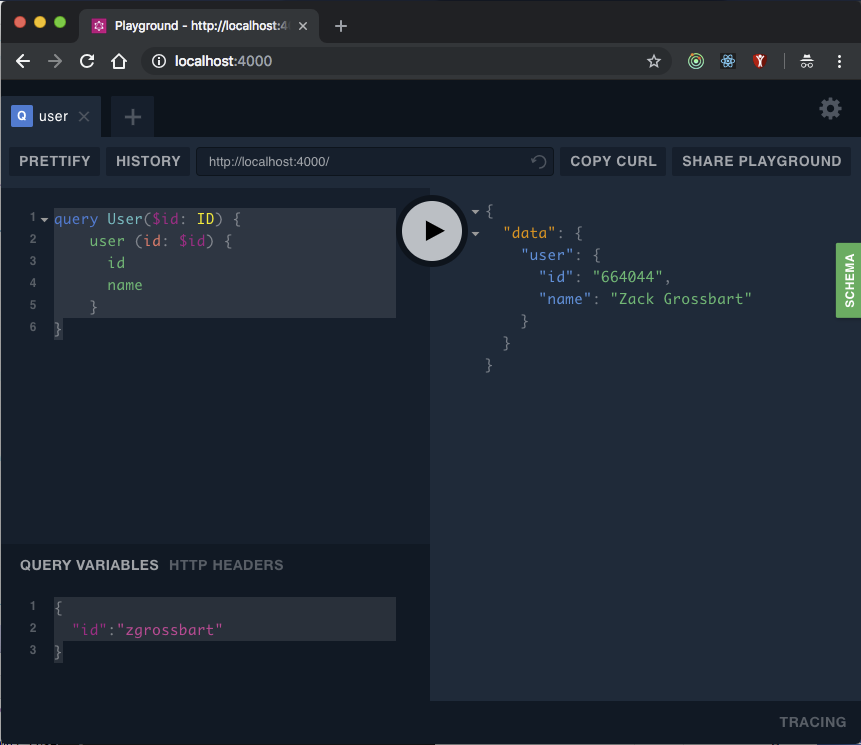

# GitHub Users Sample

This sample shows you how to build a super simple application that queries user information from GitHub.

## Running this sample

To run this sample you first need to install [NodeJS](https://nodejs.org/en/download/) which comes with `npm`.  Go to the root of the graphql-schema-bindings project and run this command:

```
npm install
```

Then switch to the `examples/xkcd` directory and running the following commands:

```
npm install
npm start
```

When the second command completes go to the following URL with your favorite browser:  [http://localhost:4000](http://localhost:4000).  This will show you the GraphQL playground for our service.  We can use this playground to make queries against our service.

The first step is to enter our query in the upper-left panel like this:

```javascript
query User($id: ID) {
  	user (id: $id) {
    	id
      name
    }
}
```

Then expand the `QUERY VARIABLES` section in the bottom left corner and add a query like this:

```javascript
{
  "id":"zgrossbart"
}
```

It should look like this:



Now press the play button in the middle of the screen to execute the call.  You should see a response like this:

```javascript
{
  "data": {
    "user": {
      "id": "664044",
      "name": "Zack Grossbart"
    }
  }
}
```
Try it out with any GitHub user ID.