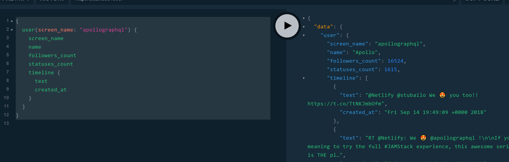

# Twitter Sample

This sample shows how GraphQL types can be composed by inheritance.

## Running this sample

To run this sample you first need to install [NodeJS](https://nodejs.org/en/download/) which comes with `npm`. Go to the root of the graphql-schema-bindings project and run this command:

```
npm install
```

Get an application key and secret from twitter at [apps.twitter.com](https://apps.twitter.com/).

Create a _.env_ file in the `examples/twitter` directory.

_.env_

```
TWITTER_KEY=<key from previous step>
TWITTER_SECRET=<secret from previous step>
```

Then navigate to the `examples/twitter` directory and run the following command:

```
npm start
```

When this command completes go to the following URL with your favorite browser: [http://localhost:4000](http://localhost:4000). This will show you the GraphQL playground for our service. We can use this playground to make queries against our service.

## Getting a user

Now that our server is running, let's get the details for a Twitter user. Enter the following query in the query section of the playground UI.

```graphql
{
  user(screen_name: "apollographql") {
    name
    statuses_count
    timeline {
      text
      created_at
    }
  }
}
```

Pressing the play button in the center of the screen will fetch information from the Twitter API similar to the following image.



## Managing your solution

This example splits its output, input, and query types across multiple files. Types can be defined in any file.

This example defines each type in its own file with the same name. This is a good approach to managing your output types.

The output types defined for this solution are:

- User ([types/User.ts](types/User.ts)): an output type representing a Twitter user.
- Tweet ([types/Tweet.ts](types/Tweet.ts)): an output type representing a Tweet object.
- Retweet ([types/Retweet.ts](types/Retweet.ts)): an output type representing a Retweet object.

The input types defined for this solution are:

- PaginationInput ([inputs/PaginationInput.ts](inputs/PaginationInput.ts)): common input fields for Twitter pagination.
- SearchInput ([inputs/SearchInput.ts](inputs/SearchInput.ts)): input fields for basic search.
- TimelineInput ([inputs/TimelineInput.ts](inputs/TimelineInput.ts)): input fields for user timelines.

This solution also has some helper functions that are kept in a _lib_ folder:

- getToken ([lib/getToken.ts](lib/getToken.ts)): fetch an access token for the Twitter API
- makeTweet ([lib/makeTweet.ts](lib/makeTweet.ts)): this is a factory function to generate the correct output Tweet type (Retweet or Tweet) based on the data returned from the API.

## @context argument vs @context field

This example binds the context as both an argument (in Twitter.ts) and as a field (in User.ts).

The context is bound during field resolution. This example uses the Twitter class as both a root query and as a context field to lend its functionality to other classes. In order to provide the context to the methods of the context Twitter instance, we accept them as function arguments and pass them from the consumers (i.e. User.timeline). @context bound fields and arguments are only assigned during GraphQL field resolution.

## Inheritance

This example shows one of the great benefits of `graphql-schema-bindings`: inheritance. A Retweet is a special kind of Tweet that includes information about the original Tweet.

We can query for retweet information like so:

```graphql
{
  search(input: { query: "#GraphQL filter:nativeretweets" }) {
    created_at
    user {
      screen_name
    }
    ... on Retweet {
      retweet {
        text
        created_at
        retweet_count
        user {
          screen_name
        }
      }
    }
  }
}
```

This will show a list of retweets: who and when retweeted it and the original tweet (who, when, what, and how many retweets).

The `retweet` field is only available to the `Retweet` type. The `Retweet` type has all of the fields that the `Tweet` type has and can be returned anywhere that a `Tweet` can be returned. It also shares the functionality of the `Tweet` type by inheritance.
